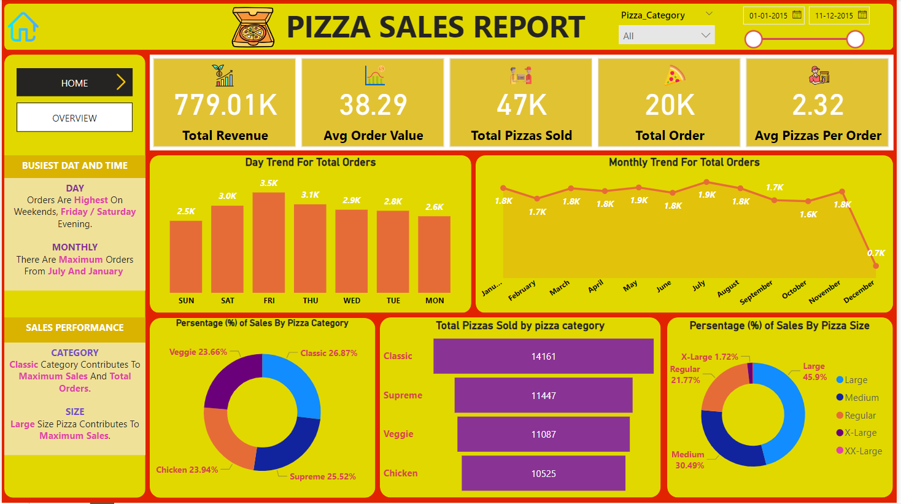

# Power_BI_Pizza_Sales_Analysis

## INTRODUCTION

Welcome to the Pizza Sales Analysis Project. 
This project leverages the powerful capabilities of Microsoft Power BI to provide insightful analysis of pizza sales data. By utilizing Power BI's interactive dashboards and data visualization tools, we aim to uncover key trends and patterns that can inform business decisions and optimize sales strategies. It provides a comprehensive view of the business's sales performance, helping stakeholders make data-driven decisions to improve sales, optimize operations, and enhance customer satisfaction.

## PROBLEM STATEMENT

The Pizza Sales Analysis Project aims to analyze key performance indicators (KPIs) and visualize critical aspects of pizza sales data to gain comprehensive insights into business performance. By leveraging Power BI, we seek to identify trends, patterns, and areas for improvement across various dimensions of sales data.

## DATA SOURCE
This is dami data.  
Format of file is csv file cantain 48,620 rows and 15 colums

## VISUALIZATION & ANALYSIS 

### STEP 1

First we study the data properly by give a sufficient time on dataset.

### STEP 2

Than we calculat KPIs 

#### Calculate Key Performance Indicators (KPIs):

-Total Revenue  
-Average Order Value (AOV)  
-Total Pizzas Sold  
-Total Orders  
-Average Pizzas Per Order  

### STEP 3

Than we visualiza a data by using different chart and we play around it to get some insight from it.

#### Visualize Data Through Various Charts:

- <u> Stacked bar chart </u> = Hourly Trend for Total Pizzas Sold  
- <u> Line chart </u> = Weekly Trend for Total Orders  
- <u> Pie chart </u> = Percentage of Sales by Pizza Category  
- <u> Pie chart </u> = Percentage of Sales by Pizza Size  
- <u> Funnel chart </u> = Total Pizzas Sold by Pizza Category  
- <u> Bar chart </u> = Top 5 Best Sellers by Revenue, Total Quantity, and Total Orders  
- <u> Bar chart </u> = Bottom 5 Best Sellers by Revenue, Total Quantity, and Total Orders  

This above 2 steps for home tab dashboard & Now we design overview dashboard which is second dashboard.

### STEP 4

#### We crate six different bar charts which show top 5 pizza and bottom 5 pizza for verious category

- <u> Top 5 pizza by revenue </u>   
- <u> Top 5 pizza by quntity </u>   
- <u> Top 5 pizza by total order </u>   
- <u> Bottom 5 pizza by revenue </u>   
- <u> Bottom 5 pizza by quntity </u>   
- <u> Bottom 5 pizza by total order </u>   

This above steps for overview tab dashboard.

#### By analyzing these KPIs and visualizations, we aim to provide actionable insights that will help optimize business operations, enhance customer satisfaction, and drive sales growth. The insights gained will support data-driven decision-making and strategic planning for the pizza chain.

## CONCLUTION

The detailed analysis of the pizza sales dataset using Power BI has provided significant insights into the busiest times, sales performance, and the best and worst-selling products. Here are the key findings and their implications for the business:

Busiest Day and Time:
Day:
Orders Are Highest On Weekends, Especially Friday and Saturday Evenings: This insight suggests that the business experiences peak order volumes during weekends, particularly in the evenings. This pattern likely reflects customers' dining habits, where they prefer to order pizzas as a treat during the weekend.
Implication: The business should ensure adequate staffing, inventory, and delivery resources during these peak times to meet the higher demand and maintain service quality.

Monthly:
Maximum Orders Are Placed in July and January: These months show a significant spike in orders, possibly due to holidays and seasonal promotions.
Implication: Seasonal marketing campaigns and promotions can be strategically planned for these months to capitalize on the increased customer demand.

Sales Performance:
Category:
Classic Category Contributes To Maximum Sales and Total Orders: The Classic pizza category is the most popular among customers, generating the highest sales and order volumes.
Implication: Focusing on maintaining and expanding the Classic pizza offerings, including introducing new variants or limited-time specials within this category, can further boost sales.

Size:
Large Size Pizza Contributes To Maximum Sales: Large pizzas are the top choice for customers, driving the most significant portion of sales.
Implication: Promotions that encourage customers to upgrade to large sizes, such as value deals or combo offers, can enhance sales.

Best Sellers:
Revenue:
The Thai Chicken Pizza Contributes To Maximum Revenue: This pizza variant generates the highest revenue, indicating strong customer preference and possibly a higher price point.
Implication: The Thai Chicken Pizza should be prominently featured in marketing materials, and its success could inspire the development of similar high-revenue items.

Total Orders and Quantity:
The Classic Deluxe Pizza Contributes To Maximum Total Orders and Quantity: This pizza variant is ordered most frequently and in the largest quantities, demonstrating broad customer appeal.
Implication: Ensuring consistent quality and availability of the Classic Deluxe Pizza is crucial, and it may be beneficial to create promotions that feature this popular item.

Worst Sellers:
Revenue, Total Orders, and Quantity:
The Brie Carre Pizza Contributes To Minimum Revenue, Total Orders, and Quantity: This pizza variant performs poorly across all sales metrics.
Implication: A review of the Brie Carre Pizza is necessary to determine whether it can be improved through recipe adjustments or marketing efforts. If not, it may be more cost-effective to remove it from the menu and replace it with a more popular option.

## Recommendations:

Resource Allocation:
Increase staff and inventory levels during weekends and the peak months of July and January to meet higher demand and maintain service quality.

Marketing Strategies:
Promote the Thai Chicken Pizza and other high-revenue items prominently.
Leverage the popularity of the Classic Deluxe Pizza in promotions and special offers.

Menu Optimization:
Focus on enhancing and expanding the Classic pizza category and large pizza offerings.
Consider removing or revamping underperforming items like the Brie Carre Pizza.

Customer Engagement:
Develop targeted marketing campaigns and promotions around the identified peak times and popular products to boost customer engagement and sales.
By implementing these recommendations, the pizza chain can optimize operations, improve customer satisfaction, and drive revenue growth, leveraging the valuable insights gained from the Power BI analysis.

